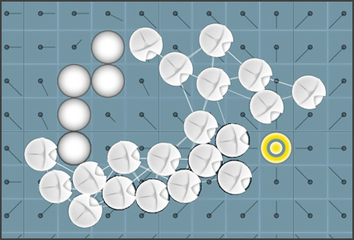

Based on [this TutsPlus tutorial](http://gamedev.tutsplus.com/tutorials/implementation/goal-based-vector-field-pathfinding/). [Play with it](http://vonwolfehaus.github.io/flow-field/) and get an explanation [over at my blog](http://coldconstructs.com/2013/10/flow-field-pathfinding-with-flocking/).

## Overview

Sometimes called flow fields, vector fields, wavefront expansion, brushfire, and so on. The idea is to use Dijkstra's algorithm to fill out a grid, starting from a single cell, with the distance from current cell to that original cell. On each cell we calculate a vector that points in the direction of the goal. As entities roll over a cell, we simply apply that vector to the entity's velocity.

This makes pathfinding very large numbers of objects very efficient. However, there are some problems such as local optima. I hoped to solve local optima with flocking--if one entity gets stuck, it will come out of it by following its neighbors out (who did not get stuck).

It didn't work as well as I hoped. I didn't spend enough time placing proper weights on the flocking rules, but just using collision resolution resulted in smoother pathing. Anyway, that's what experiments are for.

[Better flocking alg](http://jabtunes.com/labs/3d/gpuflocking/webgl_gpgpu_flocking6.html#64)?